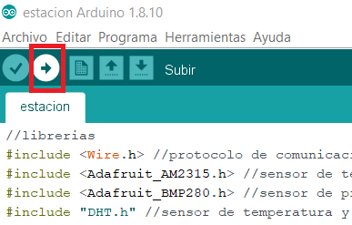
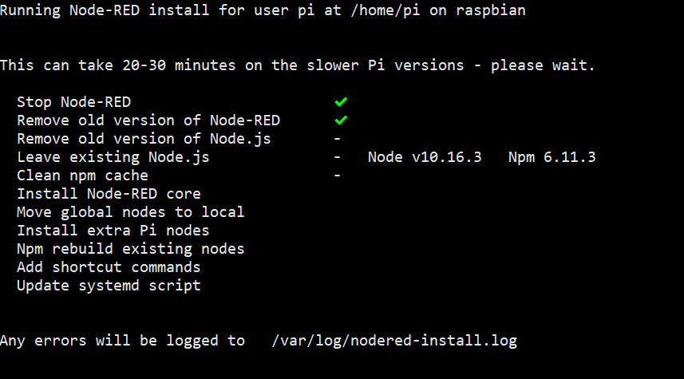
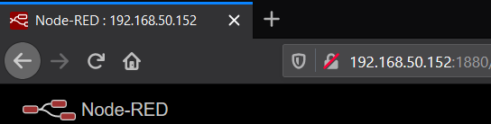

# Estación de monitoreo medioambiental y de calidad del aire de bajo costo para el sector de quintero y puchuncavi
_Estación de monitoreo medioambiental y de calidad del aire de bajo costo, utilizada como tesis de pregrado para optar al título de Ingeniero en Computación e Informática de la Universidad Andrés Bello_

## Pre-requisitos
_Instrumentos y aplicaciones mínimas para la implementación:_
- Arduino UNO.
- Raspberry Pi con SO raspbian y conexión a internet.
- A lo menos un sensor de los utilizados en este proyecto.
- Node-RED instalado en la Raspberry.
- Cliente SSH.

## Instalación


1.- Descargar el release y descomprimir.  
  
2.- Cargar script para Arduino.  
  

  
3.- Conectar el Arduino con la Raspberry Pi mediante el puerto USB
  


4.- En la Raspberry Pi, se recomienda habilitar SSH para el acceso desde otro dispositivo.  
Esto se activa en Menu > Preferencias > Configuración de Raspberry Pi, en la viñeta de Interfaces, habilitar SSH  

5.- Instalar Node-RED, para eso se abre una terminal de la Raspberry Pi y copiar el comando que está a continuación.
```
bash <(curl -sL https://raw.githubusercontent.com/node-red/raspbian-deb-package/master/resources/update-nodejs-and-nodered)
```

  

6.- Al finalizar la instalación, ingresando desde un navegador web en su red local la IP de su dispositivo Raspberry más el puerto 1880 se ingresa al programa Node-RED, como se ejemplifica en la imagen siguiente.  



7.- Dentro de Node-RED, en la esquina superior derecha, acceder al Menu > Menage palette, y seleccionar la viñeta Install.  
  
  
  
Buscar e instalar:
- node-red-dashboard.
- node-red-contrib-fs-ops.
- node-red-node-xmpp.
- node-red-contrib-simpletime.

## Importar flujo en Node-RED
Para importar un flujo a Node-RED se debe ir a `Menu > Import > Clipboard`
y copiar el flujo

